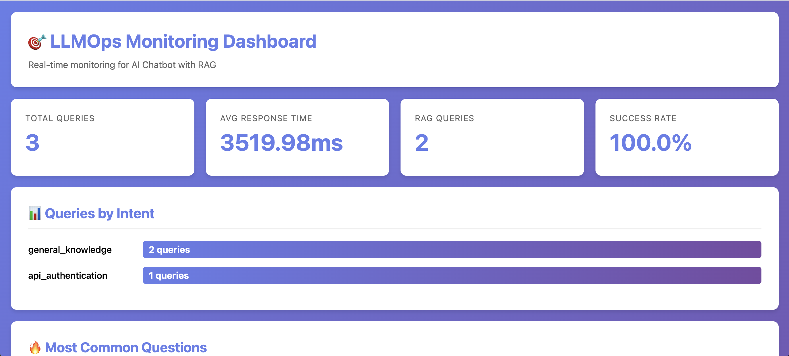
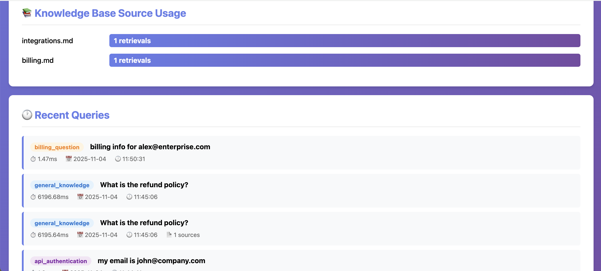
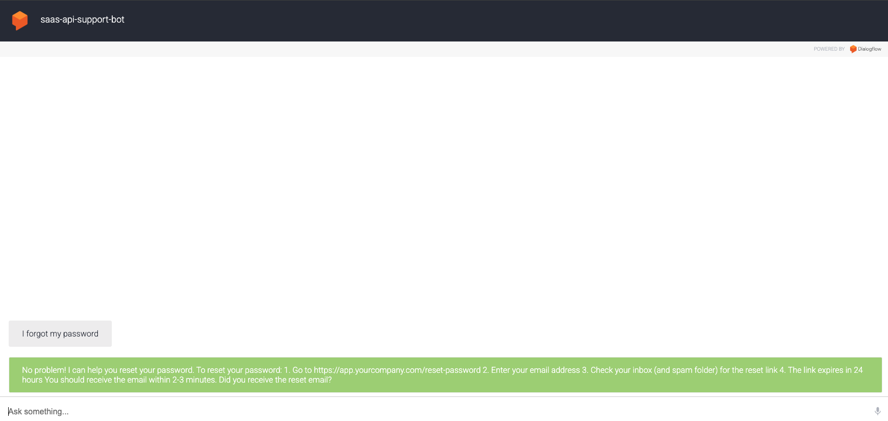

# Customer Support Chatbot

AI-powered customer support chatbot for SaaS companies using Google Dialogflow and LangChain RAG. Handles password resets, billing questions, integrations, API troubleshooting, and general documentation queries.

## Project Overview

This chatbot demonstrates end-to-end implementation of conversational AI with Retrieval-Augmented Generation (RAG), reducing support ticket volume by handling Tier 1 queries automatically while providing grounded, accurate responses from a knowledge base.

**Built for:** SaaS/API companies with technical support needs  
**Status:** ✅ Production-ready (Phase 3 Complete)

##  Core Features

- **Password Reset**: Guides users through password recovery process
- **Billing Support**: Answers common billing and invoice questions
- **Integration Help**: Assists with third-party integrations (Slack, Salesforce, etc.)
- **API Authentication**: Troubleshoots API key and authentication issues
(401/403 errors)
- **Rate Limit Support**: Explains API rate limits and quota errors
- **Knowledge Base Search (RAG)**: Searches documentation to answer general questions with source citations

### Advanced Features
- **LLMOps Monitoring Dashboard**: Real-time query analytics, performance metrics, source usage tracking
- **Dynamic Responses**: Personalized answers based on user data (subscription tier, usage, etc.)
- **Source Attribution**: Every RAG response cites documentation sources
- **Performance Tracking**: Response time monitoring and query logging
- **Intent Analytics**: Track which intents are most used

## Architecture

**Phase 1**

```
User Query → Dialogflow (NLU) → Intent Recognition → Static Response
```

**Phase 2: Webhook Integration (Local dev)**

```
User Query → Dialogflow → Intent + Parameters → Flask Webhook → User Database → Personalized Response
```

### Phase 3: RAG with LangChain (Current)
```
User Query → Dialogflow → Flask Webhook
                              ↓
                         RAG Engine (LangChain)
                              ↓
              Knowledge Base (Vector Search) → Top 3 Relevant Chunks
                              ↓
                         GPT-4 Response Generation
                              ↓
                    Answer + Source Citation
```

## LLMOps

### 1. Prompt Engineering
- Custom prompt templates version-controlled as code
- Enforces source attribution in responses
- Fallback handling for unkn queries

### 2. Query Logging
- Every query logged with metadata (timestamp, intent, response time, sources)
- Structured JSON format for analysis
- Enables continuous model improvement

### 3. Monitoring Dashboard
- Real-time metrics: query volume, response time, success rate
- Intent distribution visualization
- Knowledge base source usage analytics
- Recent queries log



### 5. Source Attribution
- All RAG responses cite documentation sources
- Transparent, verifiable answers
- Enables debugging and quality improvement



## Demo

**[Try live demo](https://console.dialogflow.com/api-client/demo/embedded/df67e36a-8f8f-4635-be10-06df92db4a04)**

 

### Monitoring Dashboard
Run locally: `python webhook/dashboard.py` → http://localhost:5001

## Local Setup
```bash
# Clone repository
git clone https://github.com/Adeel0o0/customer-support-chatbot.git
cd customer-support-chatbot/webhook

# Create virtual environment
python3 -m venv venv
source venv/bin/activate  # Mac/Linux

# Install dependencies
pip install -r requirements.txt

# Set up environment variables
cp .env.example .env
# Add your OpenAI API key to .env

# Run webhook server
python app.py  # Port 5000

# Run monitoring dashboard (separate terminal)
python dashboard.py  # Port 5001
```

## Technologies

### AI Stack
- **Dialogflow** - Natural Language Understanding
- **LangChain** - RAG framework
- **OpenAI API** - Embeddings (text-embedding-3-small) + LLM (gpt-4o-mini)
- **Chroma** - Vector database for semantic search

### Backend
- **Python 3.x** - Core language
- **Flask** - Webhook server
- **Monitoring Dashboard** - Real-time analytics

### Data
- **JSON** - User database (mock data for demo)
- **Markdown** - Knowledge base documents

---

## Success Metrics

- **Target Resolution Rate:** 60%
- **Response Time:** <2 seconds
- **Escalation Triggers:** 3 failed attempts or negative sentiment
- **Success Criteria:** CSAT >4.0/5.0

**Current Stats:**
- 3 intents with dynamic responses
- 1 RAG-powered intent searching 3 knowledge base documents
- 7 semantic chunks indexed for retrieval
- Top 3 relevant chunks retrieved per query